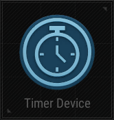
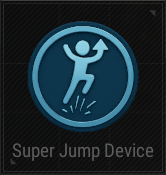

# PUBG UGC Complete Documentation

*Generated on: 2025-07-25 11:03:05*

---

---

# Introduction

# Introduction

Welcome to the unofficial PUBG UGC documentation. This guide provides detailed information on how to use devices, objects, and settings to create unique game modes and maps.

## Tutorials

## UGC Information

### 🔧 [Devices](Devices.md)

Devices are tools that add logic and interaction to your game modes.

### 🏗️ [Objects](Objects.md)

Objects are the building and environment assets of your map.

### ⚙️ [Settings](Settings.md)

Rulesets define the core rules for your game mode.

### 🗺️ [UGC Map](UGCMap.md)

Details about the UGC map.

---

# UGC Map

# UGC Map

## Overview

The UGC Map is a dedicated map designed for UGC (User-Generated Content) creations. Currently, it is unclear if additional maps will be introduced in future updates.

## Map Details

### Dimensions

- **Map Code**: *MOD_Main*
- **Size**: 2x2 km
- **Central Island**:
  - Dimensions: Approximately 400x400 m, elevated around 11 m above sea level
  - Features: Elevated cliffs around the edges.

### Boundaries

- **X and Y Axis**:
  - Bordered by an invisible wall
  - Players encountering the wall receive a message: "Outside of map"
  - Attempting to bypass the wall (e.g., via building or teleporting) results in instant transportation back to the edge
- **Z Axis (Height)**:
  - Limit: Several kilometers high
  - Building mode: Reaching the height limit may cause player death

### Rendering Behavior

- **Z Render Distance**: Approximately 1 km
- **Dynamic Loading**:
  - Assets load progressively as players ascend
  - Teleporting into an unloaded chunk may cause character glitches

## Visuals

  
  

## Notes for Creative Builders

- Teleporting into unloaded chunks can result in glitches.
- Consider the Z render distance and dynamic loading when designing teleportation paths.

---

# Settings

# Settings

## Description

Rulesets define the core rules for your game mode, allowing you to create unique gameplay experiences.  
To access the settings list:

- Press `P` to open the edit manager.
- Navigate to the **Settings** tab.
  

Below you will find a list of all available settings.

## Rule Set

| Category | Rule | Description | Default Value | Options |
|----------|------|-------------|---------------|---------|
| Mode     | Mode Type | Determine the type of mode. | NONE | NONE, SHOOTING: BATTLE ROYALE, SHOOTING: DEATHMATCH, SHOOTING: CONQUEST, OTHER SHOOTING, NON-SHOOTING: PARKOUR, NON-SHOOTING: TRAINING, OTHER NON-SHOOTING |
| Rounds   | Round Count | Set the total number of rounds. If a team wins more than half of the total rounds, that team is declared the winner and the match ends. If there are three or more teams and the number of wins is tied, all tied teams are declared winners. | 3 |  |
| Rounds   | Target Score | Set the target score required to win. The round ends when a team or player reaches the target score. If no one reaches the target score, the team or player with the higher score wins. If scores are tied, all tied teams are awarded one win. | 50 |  |
| Rounds   | Time Limit (s) | Set the time limit per round. When the time limit expires, the team with the higher score wins the round. | 600 |  |
| Rounds   | Warm-up Time (s) | Set the warm-up time before the match starts. | 10 |  |
| Rounds   | Round Warm-up Time (s) | Set the warm-up time before each round starts. | 5 |  |
| Rounds   | Target Round Count | Set the number of rounds required to win. If set to 0, the game ends when a team wins more than half of the rounds. If set to 1 or higher, the game ends when a team wins the specified number of rounds. In this case, winning more than half the rounds does not apply. | 0 |  |
| Match    | Team Count | Set the number of teams in the game. | 2 |  |
| Match    | Team Size | Set the number of players per team. | 4 |  |
| Match    | Friendly Fire Damage Ratio | Set the damage modifier for friendly fire. | 0 |  |
| Match    | Use DBNO | Determine whether the Down But Not Out system is enabled. | False |  |
| Match    | Camera View | Set the player's camera view. | FPS and TPS | FPS and TPS, FPS Only, TPS Only |
| Match    | Use Respawn | Determine whether respawn is enabled. | False |  |
| Match    | Respawn Time (s) | Set the time it takes to respawn after death. | 3 |  |
| Match    | Use Respawn Invincibility | Determine whether to apply an invincibility buff on respawn. | False |  |
| Match    | Invincibility Duration (s) | Set the invincibility buff duration after respawn. | 3 |  |
| Match    | Use Deathboxes | Determine whether to spawn a deathbox when a player dies. | False |  |
| Match    | Deathbox Duration (s) | Set the duration for which the deathbox remains. | 90 |  |
| Match    | Show Killfeed Team Numbers | Determine whether to show each team's number in the killfeed. | True |  |

## Game Options

| Option | Description | Default Value | Options |
|--------|-------------|---------------|---------|
| Allow Team Select | Allow the host to manually select teams. | False |  |
| Overflow Assign | Determine how to handle overflow players when teams are full. | Overflow Assign | Overflow Assign, Spectator, Observer |
| Enable Device Edit | Allow the host to edit devices in the game. | False |  |
| Enable Object Placement | Allow the host to place objects freely in the game. | False |  |
| Fill Test Players | Determine how test players fill empty teams or slots. | None | None, Fill One per Team, Fill All Teams |
| Enable Observer Voice Chat | Determine whether observers can use voice chat. | False |  |
| Use Log | Determine whether to enable logs for debugging or records. | True |  |

---

# Objects

# Objects

## Description

Objects are the building and enviroment assets of your map. They allow you to create and customize environments, enabling creative designs like Parkour challenges.

---

# Devices Overview

# Devices

## Description

Devices are tools that add logic and interaction to your game modes.  
They enable dynamic gameplay elements such as triggers, spawn locations, items, and more.

Devices are a core element of any game mode to be created.  
Currently, there is a limit of 1000 devices in a single UGC map.

## Accessing the Device List

To access the device list:

- Press `P` to open the edit manager.
- In the **Object List** tab, navigate to the **Device** subtab.

## Device Settings

### Open Settings

Each device has multiple settings to configure its behavior, you can access these settings in two ways:

- Press `F` while looking at the device in the world.
- Press `[` to open the Event Manager, select the device you want to edit, and click **Edit**.

### Settings

All devices have the following configuration sections:

### Name

The name of the device, which defaults to its type and an incrementing number (e.g., `Player Spawn 1`).  
You can customize this name for clarity, limited to 30 alphanumeric characters.

---

### Basic

This tab contains all the main adjustable settings for the specific device.  
Some common settings are described [here](General/Common_Device_Settings.md).

---

### Change

This tab shows only the settings that you have changed from their default values, this allows for a quick review of your adjustments.

---

### Trigger

A trigger is an event from this device that can start an action on another device.

> If **this device** does `Trigger`, do `Action` on **another device**.

---

### Action

An action is a task that this device can perform when it receives a trigger from another device.

> Do `Action` on **this device** when a `Trigger` happens on **another device**.

---

*Note: A device can never Trigger an Action on itself.*

## Device List

Below a list of all current devices available in UGC.
> [!NOTE]
> Detail pages are currently still a work-in-progress

| Device Icon | Device Name          | Description |
|-------------|----------------------|-------------|
|  | [Score Manager Device](Devices/Device_ScoreManager.md) | Manage score addition and subtraction. |
|  | [Player Spawn Device](Devices/Device_PlayerSpawn.md)   | Spawn and respawn players. |
|  | [Player Event Device](Devices/Device_PlayerEvent.md)   | Set conditions related to players and teams. |
|  | [Mover Device](Devices/Device_Mover.md)                | Move objects to a target location. |
|  | [Area Blocking Device](Devices/Device_AreaBlocking.md) | Block area to restrict player movement. |
|  | [Trigger Area Device](Devices/Device_TriggerArea.md)   | Triggers when conditions are met within a designated area. |
|  | [Air Drop Device](Devices/Device_AirDrop.md)           | Spawn AirDrop items at a specific location. |
|  | [Player Tag Device](Devices/Device_PlayerTag.md)       | Apply and remove player tags. |
|  | [Round Event Device](Devices/Device_RoundEvent.md)     | Set conditions for round-based events. |
|  | [Timer Device](Devices/Device_Timer.md)                | Set an in-game timer next to an item. |
|  | [Item Spawn Device](Devices/Device_ItemSpawn.md)       | Spawn items in a predetermined location. |
|  | [Item Provide Device](Devices/Device_ItemProvide.md)   | Directly give items to players. |
|  | [Teleport Device](Devices/Device_Teleport.md)          | Teleports players or objects to a specific location. |
|  | [Blue Zone Device](Devices/Device_BlueZone.md)         | Create a damaged zone that shrinks over time. |
|  | [Player Damage Device](Devices/Device_PlayerDamage.md) | Deal damage to players. |
|  | [Interaction Device](Devices/Device_Interaction.md)    | Allow players to interact with an object. |
|  | [Damage Trigger Device](Devices/Device_DamageTrigger.md) | Triggers when damage is taken. |
|  | [Player Status Device](Devices/Device_PlayerStatus.md) | Set or change player statuses. |
|  | [Chance Trigger Device](Devices/Device_ChanceTrigger.md) | Trigger event based on chance. |
|  | [Random Trigger Device](Devices/Device_RandomTrigger.md) | Execute a trigger randomly from a predetermined list. |
|  | [Conquest Area Device](Devices/Device_ConquestArea.md) | Create an area that can be conquered. |
|  | [Red Zone Device](Devices/Device_RedZone.md)           | Configure red zone settings. |
|  | [Vehicle Spawn Device](Devices/Device_VehicleSpawn.md) | Spawn vehicles at a specific location. |
|  | [Special Zone Device](Devices/Device_SpecialZone.md)   | Create a special zone with unique effects. |
|  | [Player Icon Device](Devices/Device_PlayerIcon.md)     | Display an icon above players. |
|  | [Super Jump Device](Devices/Device_SuperJump.md)       | Enable players to jump higher via jump pads. |
|  | [Airplane Device](Devices/Device_Airplane.md)          | Put players inside an airplane at the beginning of the match. |
|  | [Weapon Damage Device](Devices/Device_WeaponDamage.md) | Adjust the damage values of various weapons. |
|  | [BGM Device](Devices/Device_BGM.md)                    | Configure background music settings. |

---

# General Documentation

---

# Common_Device_Settings

# Common Device Settings

## Activation Phase

Set the phase during which the device is activated:

- **None**: Activates only when triggered by an event.
- **Device Creation**: Activates immediately when the device is created.
- **Standby Before Spawn**: Activates during the standby phase before players spawn.
- **Standby After Spawn**: Activates during the standby phase after players spawn.
- **Round Start Before Spawn**: Activates at round start, before players spawn.
- **Round Start After Spawn**: Activates at round start, after players spawn.

> [!NOTE]  
> Activation phase is not to be confused with when the devices does something.  
> This setting is when the device itself is available (powered ON) to perform actions & trigger events.  

The different game phases is documented more in detail [here](../General/GamePhases.md).

## Target

Set the target to which the effect is applied:

- **All Players**: Applies to all players.
- **Selected Team**: Applies only to the selected team.
- **Selected Player**: Applies only to the selected player.
- **Tagged Players**: Applies only to players with the specified tag.

---

# GamePhases

# Game Phases

The game progresses through several distinct phases. Understanding these is crucial for configuring Device Activation Phases correctly.

## Creation

This is the initialization phase of the game mode, where all objects are loaded into the map.

## Standby

Once all objects are loaded, the game enters the Standby phase. This is often referred to as the "Warm-up Time" and has two sub-phases:

- **Before Spawn**: Activates during the standby phase before players spawn.
- **After Spawn**: Activates during the standby phase after players have spawned.

## Round

A match can consist of multiple rounds. At the start of each round, the following sub-phases occur:

- **Before Spawn**: Activates at the beginning of a round, before players spawn.
- **After Spawn**: Activates at the beginning of a round, after players have spawned. This is often referred to as the "Round Warm-up Time"

---

# SaveAndLoad

# Save and Load Instructions

## How to Load a File While In-Game
1. **Download** the `.pugc` file you wish to play.
2. **Load up** your UGC Lobby and start it.
3. **Press** `F10` (Alternatively, press `P` and then click `LOAD`).
4. **Click** `OPEN EXPLORER`.
5. **Drag and drop** the `.pugc` file you downloaded into this folder.

## How to Load a File Outside of the Game
1. **Download** the `.pugc` file you wish to play.
2. **Press** `Windows + R`.
3. **Type** `%localappdata%/tslGame/Saved/UGC` and hit Enter.
4. **Drag and drop** the `.pugc` file you downloaded into this folder.

After placing a `.pugc` in the correct folder, you do not need to restart the game or lobby.
Reopen the Load menu (`F10` or `P` and then click `LOAD`) and your new UGC file will be available.

---

# Device Documentation

---

# Device_AirDrop

# Air Drop Device

## Description

Spawn AirDrop items at a specific location.

## Basic

TBD

## Trigger

TBD

## Action

TBD

---

# Device_Airplane

# Airplane Device

## Description

Put players inside an airplane at the beginning of the match.

## Basic

TBD

## Trigger

TBD

## Action

TBD

---

# Device_AreaBlocking

# Area Blocking Device

## Description

Block area to restrict player movement.

## Basic

TBD

## Trigger

TBD

## Action

TBD

---

# Device_BGM

# BGM Device

## Description

Configure background music settings.

## Basic

TBD

## Trigger

TBD

## Action

TBD

---

# Device_BlueZone

# Blue Zone Device

## Description

Create a damaged zone that shrinks over time.

## Basic

TBD

## Trigger

TBD

## Action

TBD

---

# Device_ChanceTrigger

# Chance Trigger Device

## Description

Trigger event based on chance.

## Basic

TBD

## Trigger

TBD

## Action

TBD

---

# Device_ConquestArea

# Conquest Area Device

## Description

Create an area that can be conquered.

## Basic

TBD

## Trigger

TBD

## Action

TBD

---

# Device_DamageTrigger

# Damage Trigger Device

## Description

Triggers when damage is taken.

## Basic

TBD

## Trigger

TBD

## Action

TBD

---

# Device_Interaction

# Interaction Device

## Description

Allow players to interact with an object.

## Basic

TBD

## Trigger

TBD

## Action

TBD

---

# Device_ItemProvide

# Item Provide Device

## Description

Directly give items to players.

## Basic

TBD

## Trigger

TBD

## Action

TBD

---

# Device_ItemSpawn

# Item Spawn Device

## Description

Spawn items in a predetermined location.

## Basic

TBD

## Trigger

TBD

## Action

TBD

---

# Device_Mover

# Mover Device

## Description

Move objects to a target location.

## Basic

TBD

## Trigger

TBD

## Action

TBD

---

# Device_PlayerDamage

# Player Damage Device

## Description

Deal damage to players.

## Basic

TBD

## Trigger

TBD

## Action

TBD

---

# Device_PlayerEvent

# Player Event Device

## Description

Set conditions related to players and teams.

## Basic

TBD

## Trigger

TBD

## Action

TBD

---

# Device_PlayerIcon

# Player Icon Device

## Description

Display an icon above players.

## Basic

- **Icon Type**: Define the type of icon to assign.
- **Icon Duration**: Set the duration for the icon.

## Trigger

- **On Icon Assigned**: Trigger an event when an icon is assigned.
- **On Icon Removed**: Trigger an event when an icon is removed.

## Action

- **Assign Icon**: Assign an icon to a player.
- **Remove Icon**: Remove an icon from a player.

---

# Device_PlayerSpawn

# Player Spawn Device

## Description

Spawn and respawn players.

## Basic

TBD

## Trigger

TBD

## Action

TBD

---

# Device_PlayerStatus

# Player Status Device

## Description

Set or change player statuses.

## Basic

TBD

## Trigger

TBD

## Action

TBD

---

# Device_PlayerTag

# Player Tag Device

## Description

Apply and remove player tags.

## Basic

TBD

## Trigger

TBD

## Action

TBD

---

# Device_RandomTrigger

# Random Trigger Device

## Description

Execute a trigger randomly from a predetermined list.

## Basic

TBD

## Trigger

TBD

## Action

TBD

---

# Device_RedZone

# Red Zone Device

## Description

Configure red zone settings.

## Notes

Only a single Red Zone can be active at any point in time.

## Basic

TBD

## Trigger

TBD

## Action

TBD

---

# Device_RoundEvent

# Round Event Device

## Description

Set conditions for round-based events.

## Basic

TBD

## Trigger

TBD

## Action

TBD

---

# Device_ScoreManager

# Score Manager Device

 

## Description

Manage score addition and subtraction.

## Basic

| Setting                  | Default Value         | Description         |
|--------------------------|-----------------------|---------------------|
| [Activation Phase](Common_Device_Settings.md#activation-phase)        | Device Creation       | The phase when the device is activated. |
| [Target](Common_Device_Settings.md#target)                  | All Players           | Specifies the target players. |
| Score                   | 1                     | The initial score value. |
| Max Score               | 9999                  | The maximum score limit. |
| Min Score               | -9999                 | The minimum score limit. |
| Target Score            | 100                   | The score required to achieve the target. |
| Enable Activation Limit | Unchecked             | Whether activation limit is enabled. |

## Trigger

- **On Condition Met**
- **On Deactivate Device**
- **On Activate Device**

## Action

- **Reset Score**
- **Change Score**
- **Deactivate Device**
- **Activate Device**

---

# Device_SpecialZone

# Special Zone Device

## Description

Create a special zone with unique effects.

## Basic

TBD

## Trigger

TBD

## Action

TBD

---

# Device_SuperJump

# Super Jump Device

## Description

Enable players to jump higher via jump pads.

## Basic

TBD

## Trigger

TBD

## Action

TBD

---

# Device_Teleport

# Teleport Device

## Description

Teleports players or objects to a specific location.

## Basic

TBD

## Trigger

TBD

## Action

TBD

---

# Device_Timer

# Timer Device

## Description

Set an in-game timer next to an item.

## Basic

TBD

## Trigger

TBD

## Action

TBD

---

# Device_TriggerArea

# TriggerArea Device

# Name
Trigger Area Device

# Description

Triggers when conditions are met within a designated area.

# Basic
TBD

# Change
TBD

# Trigger
TBD

# Action
TBD

---

# Device_VehicleSpawn

# VehicleSpawn Device

## Name

Vehicle Spawn Device

## Description

Spawn vehicles at a specific location.

## Basic

TBD

## Trigger

TBD

## Action

TBD

---

# Device_WeaponDamage

# Weapon Damage Device

## Description

Adjust the damage values of various weapons.

## Basic

TBD

## Trigger

TBD

## Action

TBD

