# Devices

## Description

Devices are tools that add logic and interaction to your game modes.
They enable dynamic gameplay elements such as triggers, spawn locations, items, and more.

Devices are a core element of any game mode to be created.  
Currently, there is a limit of 1000 devices in a single UGC map.

## Accessing the Device List

To access the device list:

- Press `P` to open the edit manager.
- In the **Object List** tab, navigate to the **Device** subtab.

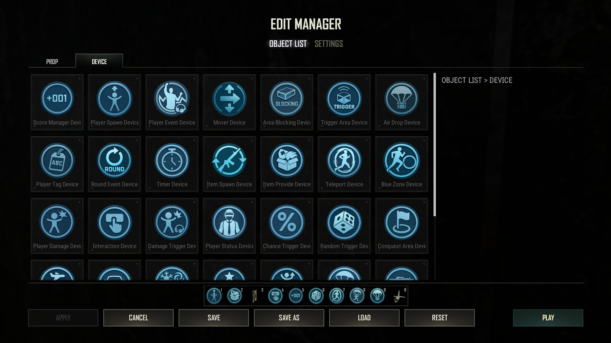

## Device Settings

Each device has multiple settings to configure its behavior, you can access these settings in two ways:

- Press `F` while looking at the device in the world.
- Press `[` to open the Event Manager, select the device you want to edit, and click **Edit**.

All devices have the following configuration sections:

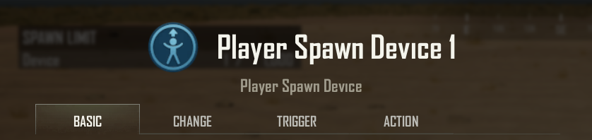

### Name

The name of the device, which defaults to its type and an incrementing number (e.g., `Player Spawn 1`).  
You can customize this name for clarity, limited to 30 alphanumeric characters.

---

### Basic

This tab contains all the main adjustable settings for the specific device.  
Some common settings are described [here](Common_Device_Settings.md).

---

### Change

This tab shows only the settings that you have changed from their default values, this allows for a quick review of your adjustments.

---

### Trigger

A trigger is an event from this device that can start an action on another device.

> If **this device** does `Trigger`, do `Action` on **another device**.

---

### Action

An action is a task that this device can perform when it receives a trigger from another device.

> Do `Action` on **this device** when a `Trigger` happens on **another device**.

---

*Note: A device can never Trigger an Action on itself.*

## Device List

| Device Icon | Device Name          | Description |
|-------------|----------------------|-------------|
| 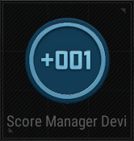 | [Score Manager Device](Device_ScoreManager.md) | Manage score addition and subtraction. |
| 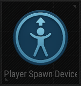 | [Player Spawn Device](Device_PlayerSpawn.md)   | Spawn and respawn players. |
| 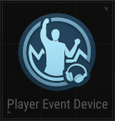 | [Player Event Device](Device_PlayerEvent.md)   | Set conditions related to players and teams. |
| 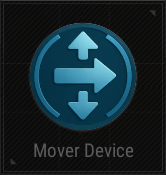 | [Mover Device](Device_Mover.md)                | Move objects to a target location. |
| 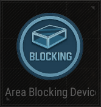 | [Area Blocking Device](Device_AreaBlocking.md) | Block area to restrict player movement. |
|  | [Trigger Area Device](Device_TriggerArea.md)   | Triggers when conditions are met within a designated area. |
| 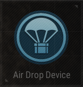 | [Air Drop Device](Device_AirDrop.md)           | Spawn AirDrop items at a specific location. |
| 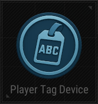 | [Player Tag Device](Device_PlayerTag.md)       | Apply and remove player tags. |
| 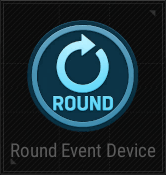 | [Round Event Device](Device_RoundEvent.md)     | Set conditions for round-based events. |
| 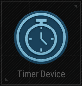 | [Timer Device](Device_Timer.md)                | Set an in-game timer next to an item. |
|  | [Item Spawn Device](Device_ItemSpawn.md)       | Spawn items in a predetermined location. |
| 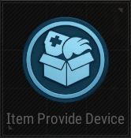 | [Item Provide Device](Device_ItemProvide.md)   | Directly give items to players. |
|  | [Teleport Device](Device_Teleport.md)          | Teleports players or objects to a specific location. |
| 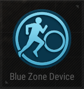 | [Blue Zone Device](Device_BlueZone.md)         | Create a damaged zone that shrinks over time. |
| 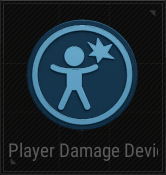 | [Player Damage Device](Device_PlayerDamage.md) | Deal damage to players. |
|  | [Interaction Device](Device_Interaction.md)    | Allow players to interact with an object. |
| 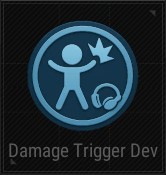 | [Damage Trigger Device](Device_DamageTrigger.md) | Triggers when damage is taken. |
|  | [Player Status Device](Device_PlayerStatus.md) | Set or change player statuses. |
| 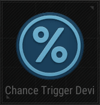 | [Chance Trigger Device](Device_ChanceTrigger.md) | Trigger event based on chance. |
| 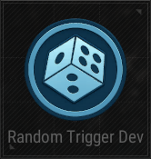 | [Random Trigger Device](Device_RandomTrigger.md) | Execute a trigger randomly from a predetermined list. |
| 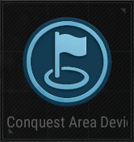 | [Conquest Area Device](Device_ConquestArea.md) | Create an area that can be conquered. |
| 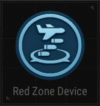 | [Red Zone Device](Device_RedZone.md)           | Configure red zone settings. |
| 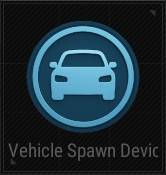 | [Vehicle Spawn Device](Device_VehicleSpawn.md) | Spawn vehicles at a specific location. |
| 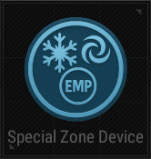 | [Special Zone Device](Device_SpecialZone.md)   | Create a special zone with unique effects. |
| 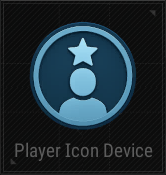 | [Player Icon Device](Device_PlayerIcon.md)     | Display an icon above players. |
| 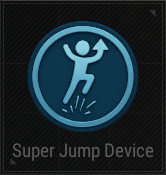 | [Super Jump Device](Device_SuperJump.md)       | Enable players to jump higher via jump pads. |
| 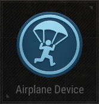 | [Airplane Device](Device_Airplane.md)          | Put players inside an airplane at the beginning of the match. |
| 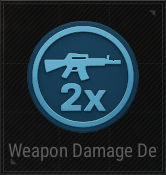 | [Weapon Damage Device](Device_WeaponDamage.md) | Adjust the damage values of various weapons. |
| 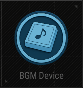 | [BGM Device](Device_BGM.md)                    | Configure background music settings. |
