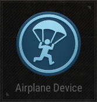

# Airplane Device

## Description

Put players inside an airplane.

## Basic

| Setting                                      | Default Value     | Type | Range | Description                                      |
|----------------------------------------------|-------------------|------|-------|--------------------------------------------------|
| [Activation Phase](../General/Common_Device_Settings.md#activation-phase) | Device Creation    | | | The phase when the device is activated.           |
| [Target](../General/Common_Device_Settings.md#target)                     | Activating Team    | Options | Activating Team, Activating Player, All Players, Selected Team, Selected Player, Tagged Players | Specifies the target team.                        |
| Route Type                                   | Center            | Options | Center, BlueZoneCenter, Device, Random | The route type for the airplane.                  |
| Min Fall Distance                            | 20                | Number | 10-80 | Minimum distance for falling.                     |
| Airplane Starting Radius                     | 100               | Number | 10-100 | Starting radius of the airplane.                  |
| Airplane Speed                               | 4000              | Number | 1-100000 | Speed of the airplane.                            |
| Airplane Distance to Target                  | 10000             | Number | 1-100000 | Distance from airplane to target.                 |
| Airplane Altitude                            | 100000            | Number | 1-100000 | Altitude of the airplane.                         |
| Parachute Start Deploy Altitude              | 30000             | Number | 100-100000 | Altitude to start parachute deployment.           |
| Parachute Auto Deploy Altitude               | 15000             | Number | 100-100000 | Altitude for automatic parachute deployment.      |

## Trigger

| Trigger                | Description                                                        |
|------------------------|--------------------------------------------------------------------|
| On Start Airplane      | Triggered when the airplane starts.                                |
| On Player Eject        | Triggered when a player ejects from the airplane.                  |
| On Deactivate Device   | Triggered when the device is deactivated.                          |
| On Activate Device     | Triggered when the device is activated.                            |

## Action

| Action                | Description                                                        |
|-----------------------|--------------------------------------------------------------------|
| Start Airplane        | Starts the airplane.                                                |
| Deactivate Device     | Disables the target device when this device is triggered.           |
| Activate Device       | Enables the target device when this device is triggered.            |
