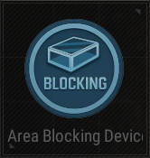

# Area Blocking Device

## Description

Block area to restrict player movement.

## Basic

| Setting                                      | Default Value     | Type | Range | Description                                      |
|----------------------------------------------|-------------------|------|-------|--------------------------------------------------|
| [Activation Phase](../General/Common_Device_Settings.md#activation-phase) | Device Creation    | Option | | The phase when the device is activated.           |
| Block Throwables                             | False             | Boolean | True, False | Blocks throwable items from entering the area.    |
| Blue Effect                                  | False             | Boolean | True, False | Enables a blue visual effect in the blocked area. |
| Block Area                                   | False             | Boolean | True, False | Enables area blocking.                           |
| Block Area Shape                             | Box               | Option | Box, Sphere | Shape of the blocked area.                        |
| Block Area Size                              | X: 50, Y: 50, Z: 50 | Vector | 0-100000 per axis | Size of the blocked area in centimeters.         |

## Trigger

| Trigger                | Description                                                        |
|------------------------|--------------------------------------------------------------------|
| On Deactivate Device   | Triggered when the device is deactivated.                          |
| On Activate Device     | Triggered when the device is activated.                            |

## Action

| Action                        | Description                                                        |
|-------------------------------|--------------------------------------------------------------------|
| Deactivate Throwable Blocking | Disables throwable blocking in the area.                          |
| Deactivate Blue Effect        | Disables the blue effect in the area.                             |
| Deactivate Blocking           | Disables area blocking.                                            |
| Activate Throwable Blocking   | Enables throwable blocking in the area.                           |
| Activate Blue Effect          | Enables the blue effect in the area.                              |
| Activate Blocking             | Enables area blocking.                                             |
| Deactivate Device             | Disables the target device when this device is triggered.          |
| Activate Device               | Enables the target device when this device is triggered.           |
