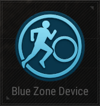

# Blue Zone Device

## Description

Configure a Blue Zone.

## Basic

| Setting | Default Value | Type | Range | Description |
|----------------------------------------------|-------------------|------|-------|--------------------------------------------------|
| [Activation Phase](../General/Common_Device_Settings.md#activation-phase) | Device Creation | Option | | The phase when the device is activated. |
| Blue Zone Shape | Circle | Option | Circle, Rectangle | The shape of the blue zone. |
| Blue Zone Options | See below | Array | 0-10 Blue Zone Options| Array of options for each blue zone phase. |

### Blue Zone Options

| Option                | Default Value | Type | Range | Description |
|-----------------------|---------------|------|-------|--------------------------------------------------|
| Start Delay (s)       | 60            | Number | 0-300 | Delay before the blue zone starts. |
| Warning Duration (s)  | 60            | Number | 0-300 | Duration of the warning before shrinking. |
| Shrink Duration (s)   | 120           | Number | 0-300 | Duration of the shrinking phase. |
| Damage per Second     | 2             | Number | 0-100 | Damage dealt per second inside the blue zone. |
| Shrink Ratio          | 0.6           | Number | 0-0.99 | Ratio to shrink the blue zone. |
| Expand Ratio          | 0.56          | Number | 0-15 | Ratio to expand the blue zone. |
| Land Probability      | 70            | Number | 0-100 | Probability of landing in the blue zone. |

## Trigger

| Trigger | Description |
|------------------------|--------------------------------------------------------------------|
| On Stop Blue Zone | Triggered when the blue zone stops. |
| On Start Blue Zone | Triggered when the blue zone starts. |
| On Resume Blue Zone | Triggered when the blue zone resumes. |
| On Pause Blue Zone | Triggered when the blue zone pauses. |
| On Deactivate Device | Triggered when the device is deactivated. |
| On Activate Device | Triggered when the device is activated. |

## Action

| Action | Description |
|-----------------------|--------------------------------------------------------------------|
| Stop Blue Zone | Stops the blue zone. |
| Start Blue Zone | Starts the blue zone. |
| Resume Blue Zone | Resumes the blue zone. |
| Pause Blue Zone | Pauses the blue zone. |
| Deactivate Device | Disables the target device when this device is triggered. |
| Activate Device | Enables the target device when this device is triggered. |
