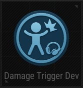

# Damage Trigger Device

## Description

Triggers when this device takes damage.

## Basic

| Setting                                      | Default Value     | Type | Range | Description                                      |
|----------------------------------------------|-------------------|------|-------|--------------------------------------------------|
| [Activation Phase](../General/Common_Device_Settings.md#activation-phase) | Device Creation    | Option | | The phase when the device is activated.           |
| [Target](../General/Common_Device_Settings.md#target)                     | All Players        | Option | Activating Team, Activating Player, All Players, Selected Team, Selected Player, Tagged Players | Specifies the target players.                     |
| Damage Amount                                | 0                 | Number | 0-1000 | Amount of damage required to trigger.             |
| Hit Count                                    | 0                 | Number | 0-100 | Number of hits required to trigger.               |
| Allowed Damage Types                         |   | Multi-select | Damage_None, Damage_Instant, Damage_Gun, Damage_Melee, Damage_Punch, Damage_ZombiePunch, Damage_Groggy, Damage_BlueZone, Damage_VehicleHit, Damage_VehicleCrashHit, Damage_Molotov, Damage_Explosion, Damage_Explosion_Grenade, Damage_Explosion_RedZone, Damage_Explosion_Vehicle, Damage_Explosion_PlantedTimeBomb, Damage_Instant_Fall | Types of damage that can trigger the device.      |
| Use Point Damage                             | True              | Boolean | True, False | Allows point damage to trigger the device.        |
| Use Radial Damage                            | True              | Boolean | True, False | Allows radial damage to trigger the device.       |
| Select Object                                | Cube              | Option | Cube, Cupboard, RedBall, RedLight, RangeTarget1, RangeTarget2, RangeTarget3, RangeTarget4, RangeTarget5, RangeTarget6, RangeTarget7 | The object to be damaged.                         |

## Trigger

| Trigger                | Description                                                        |
|------------------------|--------------------------------------------------------------------|
| On Hit Count Reached   | Triggered when the hit count is reached.                           |
| On Damage Amount Reached | Triggered when the damage amount is reached.                     |
| On Damaged             | Triggered when the object is damaged.                              |
| On Deactivate Device   | Triggered when the device is deactivated.                          |
| On Activate Device     | Triggered when the device is activated.                            |

## Action

| Action                | Description                                                        |
|-----------------------|--------------------------------------------------------------------|
| Reset Hit Count       | Resets the hit count for the device.                                |
| Reset Damage Amount   | Resets the damage amount for the device.                            |
| Deactivate Device     | Disables the target device when this device is triggered.           |
| Activate Device       | Enables the target device when this device is triggered.            |
