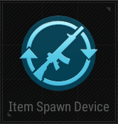

# Item Spawn Device

## Description

Spawn items in a predetermined location.

## Basic

| Setting                   | Default Value | Type | Range | Description                                                                 |
|--------------------------|---------------|------|-------|-----------------------------------------------------------------------------|
| [Activation Phase](../General/Common_Device_Settings.md#activation-phase) | Device Creation | | | The phase when the device becomes active.                                 |
| Show Device               | False        | Boolean | True, False | Whether the device is visible in the game.                                  |
| First Spawn Time (s)      | 0            | Number | 0-3600 | Time in seconds before the first item spawns.                               |
| Respawn Time (s)          | 0            | Number | 0-3600 | Time in seconds before items respawn after being picked up.                  |
| Spawn Type                | Sequential   | Option | Sequential, Random, No Repeats Random | Define the method by which the items are spawned. Sequential: Spawns items in order, one by one. Random: Spawns items randomly with possible repetition. No Repeats Random: Spawns items randomly without repetition. |
| Use Duplicate Spawn       | False        | Boolean | True, False | Allows spawning duplicate items.                                            |
| Item List                 |              | Item Selector | All | List of items to spawn.                                                     |
| Use Infinite Ammo         | False        | Boolean | True, False | Spawned items have infinite ammo.                                           |
| Use Reload Without Ammo   | False        | Boolean | True, False | Allows reload even if no ammo is present.                                   |
| Use Auto Reload           | False        | Boolean | True, False | Enables automatic reload for spawned items.                                 |

## Trigger

| Trigger                | Description                                                                |
|-----------------------|----------------------------------------------------------------------------|
| On Item Spawn         | Triggered when an item is spawned.                                          |
| Deactivate Device     | Disables the target device when this device is triggered.                   |
| Activate Device       | Enables the target device when this device is triggered.                    |

## Action

| Action                | Description                                                                |
|-----------------------|----------------------------------------------------------------------------|
| Spawn Item            | Spawns the specified item(s).                                              |
| Deactivate Device     | Triggered when the device is deactivated.                                  |
| Activate Device       | Triggered when the device is activated.                                    |
