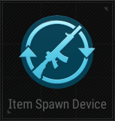

# Item Spawn Device

## Description

Spawn items in a predetermined location.

## Basic

| Setting                   | Description                                                                 | Default Value |
|--------------------------|-----------------------------------------------------------------------------|--------------|
| [Activation Phase](../General/Common_Device_Settings.md#activation-phase) | The phase when the device becomes active.                                 | Device Creation |
| Show Device               | Whether the device is visible in the game.                                  | False        |
| First Spawn Time (s)      | Time in seconds before the first item spawns.                               | 0            |
| Respawn Time (s)          | Time in seconds before items respawn after being picked up.                  | 0            |
| Spawn Type                | The method used to spawn items (Sequential or other types).                  | Sequential   |
| Use Duplicate Spawn       | Allows spawning duplicate items.                                            | False        |
| Item List                 | List of items to spawn.                                                     |              |
| Use Infinite Ammo         | Spawned items have infinite ammo.                                           | False        |
| Use Reload Without Ammo   | Allows reload even if no ammo is present.                                   | False        |
| Use Auto Reload           | Enables automatic reload for spawned items.                                 | False        |

## Trigger

| Trigger                | Description                                                                |
|-----------------------|----------------------------------------------------------------------------|
| On Item Spawn         | Triggered when an item is spawned.                                          |
| Deactivate Device     | Disables the target device when this device is triggered.                   |
| Activate Device       | Enables the target device when this device is triggered.                    |

## Action

| Action                | Description                                                                |
|-----------------------|----------------------------------------------------------------------------|
| Spawn Item            | Spawns the specified item(s).                                              |
| Deactivate Device     | Triggered when the device is deactivated.                                  |
| Activate Device       | Triggered when the device is activated.                                    |
