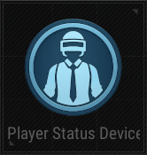

# Player Status Device

## Description

Set or change player statuses.

## Basic

| Setting                                      | Default Value     | Type | Range | Description                                      |
|----------------------------------------------|-------------------|------|-------|--------------------------------------------------|
| [Activation Phase](../General/Common_Device_Settings.md#activation-phase) | Device Creation    | Option | | The phase when the device is activated.           |
| [Target](../General/Common_Device_Settings.md#target)                     | All Players        | Options | Activating Team, Activating Player, All Players, Selected Team, Selected Player, Tagged Players | Specifies the target players.                     |
| Health                                       | 100               | Number | 1-1000000 | Sets the player's health.                         |
| Max Health                                   | 100               | Number | 1-1000000 | Sets the player's maximum health.                 |
| Show Health Bar Text                         | False             | Boolean | True, False | Shows health bar text if checked.                 |
| God Mode                                     | False             | Boolean | True, False | Enables god mode if checked.                      |
| Use Fall Damage                              | True              | Boolean | True, False | Enables fall damage if checked.                   |
| Character Scale                              | 100               | Number | 50-150 | Sets the player's character scale.                |
| Gravity Ratio                                | 100               | Number | 10-200 | Sets the player's gravity ratio.                  |
| Jump Ratio                                   | 100               | Number | 10-200 | Sets the player's jump ratio.                     |
| Speed Ratio                                  | 100               | Number | 10-200 | Sets the player's speed ratio.                    |

## Trigger

| Trigger                        | Description                                                        |
|--------------------------------|--------------------------------------------------------------------|
| On Change Speed Ratio          | Triggered when the speed ratio changes.                             |
| On Change Max Health           | Triggered when the max health changes.                              |
| On Change Jump Ratio           | Triggered when the jump ratio changes.                              |
| On Change Health               | Triggered when the health changes.                                  |
| On Change Gravity Ratio        | Triggered when the gravity ratio changes.                           |
| On Change God Mode             | Triggered when god mode changes.                                    |
| On Change Character Scale      | Triggered when the character scale changes.                         |
| On Change Fall Damage          | Triggered when fall damage changes.                                 |
| On Apply All                   | Triggered when all settings are applied.                            |
| On Deactivate Device           | Triggered when the device is deactivated.                           |
| On Activate Device             | Triggered when the device is activated.                             |

## Action

| Action                        | Description                                                        |
|-------------------------------|--------------------------------------------------------------------|
| Set Speed Ratio                | Sets the player's speed ratio.                                      |
| Set Max Health                 | Sets the player's maximum health.                                   |
| Set Jump Ratio                 | Sets the player's jump ratio.                                       |
| Set Health Bar Text Visibility | Sets the visibility of the health bar text.                        |
| Set Health                     | Sets the player's health.                                           |
| Set Gravity Ratio              | Sets the player's gravity ratio.                                    |
| Set God Mode                   | Sets god mode for the player.                                       |
| Set Character Scale            | Sets the player's character scale.                                  |
| Set Use Fall Damage            | Sets whether fall damage is enabled.                                |
| Apply All                      | Applies all settings.                                               |
| Deactivate Device              | Disables the target device when this device is triggered.           |
| Activate Device                | Enables the target device when this device is triggered.            |
