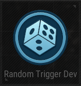

# Random Trigger Device

## Description

Execute a trigger randomly from a predetermined list.

## Basic

| Setting                                      | Default Value     | Type | Range | Description                                      |
|----------------------------------------------|-------------------|------|-------|--------------------------------------------------|
| [Activation Phase](../General/Common_Device_Settings.md#activation-phase) | Device Creation    | Option | | The phase when the device is activated.           |
| Target Count                                 | 1                 | Number | 1-100000 | Number of targets to trigger randomly.            |

## Trigger

| Trigger                | Description                                                        |
|------------------------|--------------------------------------------------------------------|
| On Trigger             | Triggered when the device is triggered.                             |
| On Deactivate Device   | Triggered when the device is deactivated.                          |
| On Activate Device     | Triggered when the device is activated.                            |

## Action

| Action                | Description                                                        |
|-----------------------|--------------------------------------------------------------------|
| Trigger               | Triggers the target device.                                         |
| Deactivate Device     | Disables the target device when this device is triggered.           |
| Activate Device       | Enables the target device when this device is triggered.            |
