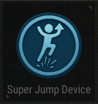

# Super Jump Device

## Description

Enable players to jump higher via jump pads.

## Basic

| Setting                                      | Default Value     | Type | Range | Description                                      |
|----------------------------------------------|-------------------|------|-------|--------------------------------------------------|
| [Activation Phase](../General/Common_Device_Settings.md#activation-phase) | Device Creation    | Option | | The phase when the device is activated.           |
| Upward Speed Ratio                           | 200               | Number | 1-1000 | Set the ratio for the upward jump speed provided by the jump pad.    |
| Type                                         | Caller Up         | Options | Caller Up, Reflect | Set the behavior type of the jump pad. Caller Up: Launches the calling player upward. Reflect: Reflects the player's direction based on the incoming velocity. |

## Trigger

| Trigger                | Description                                                        |
|------------------------|--------------------------------------------------------------------|
| On Jump Started        | Triggered when a jump is started.                                  |
| On Deactivate Device   | Triggered when the device is deactivated.                          |
| On Activate Device     | Triggered when the device is activated.                            |

## Action

| Action                | Description                                                        |
|-----------------------|--------------------------------------------------------------------|
| Launch                | Launches the player with the configured jump.                      |
| Deactivate Device     | Disables the target device when this device is triggered.           |
| Activate Device       | Enables the target device when this device is triggered.            |
