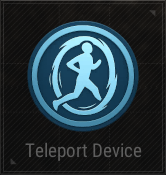

# Teleport Device

## Description

Teleports players or objects to a specific location.

## Basic

| Setting                                      | Default Value     | Type | Range | Description                                      |
|----------------------------------------------|-------------------|------|-------|--------------------------------------------------|
| [Activation Phase](../General/Common_Device_Settings.md#activation-phase) | Device Creation    | Option | | The phase when the device is activated.           |
| [Target](../General/Common_Device_Settings.md#target)                     | Activating Player  | Options | Activating Player, Selected Player, Tagged Players | Specifies the target player.                      |
| Visualization Color                          | White             | Options | None, White, Black, Red, Green, Blue, Yellow, Cyan, Magenta, Orange, Purple, Turquoise, Silver, Emerald | The color used for device visualization.          |

## Trigger

| Trigger                | Description                                                        |
|------------------------|--------------------------------------------------------------------|
| On Teleport            | Triggered when teleport occurs.                                     |
| On Deactivate Device   | Triggered when the device is deactivated.                          |
| On Activate Device     | Triggered when the device is activated.                            |

## Action

| Action                | Description                                                        |
|-----------------------|--------------------------------------------------------------------|
| Teleport              | Teleports the target to the specified location.                     |
| Deactivate Device     | Disables the target device when this device is triggered.           |
| Activate Device       | Enables the target device when this device is triggered.            |
