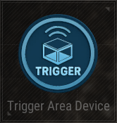

# TriggerArea Device

## Name

Trigger Area Device

## Description

Triggers on Enter or Exit.

## Basic

| Setting                                      | Default Value     | Type | Range | Description                                      |
|----------------------------------------------|-------------------|------|-------|--------------------------------------------------|
| [Activation Phase](../General/Common_Device_Settings.md#activation-phase) | Device Creation    | Option | | The phase when the device is activated.           |
| [Target](../General/Common_Device_Settings.md#target)                     | All Players        | Options | All Players, Selected Team, Selected Player, Tagged Players | Specifies the target players.                     |
| Area Shape                                   | Sphere            | Option | Sphere, Box | Shape of the trigger area.                        |
| Area Color                                   | White             | Options | None, White, Black, Red, Green, Blue, Yellow, Cyan, Magenta, Orange, Purple, Turquoise, Silver, Emerald | Color of the trigger area.                        |
| Sphere Radius (cm)                           | 50                | Number | 0-100000 | Radius of the sphere area in centimeters.         |
| Area Size                           | X:50, Y:50, Z:50                 | Vector | 0-100000 per axis | Set size of a box-sized area.         |
| Check Interval (s)                           | 0.1               | Number | 0.1-3600 | Interval for checking conditions in seconds.      |
| Trigger Type                                 | Both              | Options | On Enter, On Exit, Both | Type of trigger (Enter, Exit, or Both).           |

## Trigger

| Trigger                | Description                                                        |
|------------------------|--------------------------------------------------------------------|
| On Exit                | Triggered when a target exits the area.                            |
| On Enter               | Triggered when a target enters the area.                           |
| On Deactivate Device   | Triggered when the device is deactivated.                          |
| On Activate Device     | Triggered when the device is activated.                            |

## Action

| Action                | Description                                                        |
|-----------------------|--------------------------------------------------------------------|
| Stop Movement         | Stops the movement of the object.                                   |
| Start Movement        | Starts the movement of the object.                                  |
| Deactivate Device     | Disables the target device when this device is triggered.           |
| Activate Device       | Enables the target device when this device is triggered.            |
