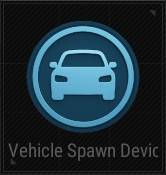

# VehicleSpawn Device

## Name

Vehicle Spawn Device

## Description

Spawn vehicles at a specific location.

## Notes

Vehicles do not get spawned on Device Activation. They require an external trigger to the action: `Spawn Vehicle`.

## Basic

| Setting                                                      | Default Value     | Type | Range | Description                                                                 |
|--------------------------------------------------------------|-------------------|------|-------|-----------------------------------------------------------------------------|
| [Activation Phase](../General/Common_Device_Settings.md#activation-phase) | Device Creation    | Option | | The phase when the device is activated.                                      |
| Spawn Vehicle                                                | UAZ               | Option | UAZ, Dacia, Buggy, CoupeRB, Motorbike, PickupTruck, Mirado, MiniBus, Dirtbike, PonyCoupe, Porter, Jima, Rony, Pillar_Car, Food_Truck, Blanc, PicoBus, AquaRail, Boat, Motorglider, Bicycle | Type of vehicle to spawn.                                                    |
| Vehicle Health                                               | 3000              | Number | 1-5000 | Initial health of the spawned vehicle.                                       |
| Remove on Destruction                                        | True              | Boolean | True, False | Removes the vehicle when destroyed.                                          |
| Use Fuel                                                     | True              | Boolean | True, False | Enables fuel usage for the vehicle.                                          |
| Initial Fuel                                                 | 50                | Number | 0-100 | Amount of fuel when spawned.                                                 |
| Use Auto Respawn                                             | False             | Boolean | True, False | Automatically respawns the vehicle when destroyed.                           |
| Area Shape                                                   | Sphere            | Option | Sphere | Shape of the spawn area.                                                     |
| Area Size                                                    | 50                | Number | 0-100000 | Size of the spawn area.                                                      |

## Trigger

| Trigger                | Description                                                        |
|------------------------|--------------------------------------------------------------------|
| On Vehicle Destruction | Triggered when the spawned vehicle is destroyed.                   |
| On Spawn Vehicle       | Triggered when a vehicle is spawned.                               |
| On Deactivate Device   | Triggered when the device is deactivated.                          |
| On Activate Device     | Triggered when the device is activated.                            |

## Action

| Action                | Description                                                        |
|-----------------------|--------------------------------------------------------------------|
| Spawn Vehicle         | Spawns the selected vehicle.                                        |
| Deactivate Device     | Disables the target device when this device is triggered.           |
| Activate Device       | Enables the target device when this device is triggered.            |
