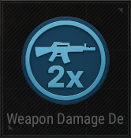

# Weapon Damage Device

## Description

Adjust the damage values of various weapons.

## Basic

| Setting                                      | Default Value     | Type | Range | Description                                      |
|----------------------------------------------|-------------------|------|-------|--------------------------------------------------|
| [Activation Phase](../General/Common_Device_Settings.md#activation-phase) | Device Creation    | Option | | The phase when the device is activated.           |
| [Target](../General/Common_Device_Settings.md#target)                     | Activating Team    | Options | Activating Team, Activating Player, All Players, Selected Team, Selected Player, Tagged Players | Specifies the target team.                        |
| Throwable Damage                            | 100               | Number | 0-1000 | Damage dealt by throwable weapons.                |
| Bullet Damage - Head                        | 100               | Number | 0-1000 | Damage dealt by bullets to the head.              |
| Bullet Damage - Upper Body                  | 100               | Number | 0-1000 | Damage dealt by bullets to the upper body.        |
| Bullet Damage - Lower Body                  | 100               | Number | 0-1000 | Damage dealt by bullets to the lower body.        |
| Bullet Damage - Arms                        | 100               | Number | 0-1000 | Damage dealt by bullets to the arms.              |
| Bullet Damage - Legs                        | 100               | Number | 0-1000 | Damage dealt by bullets to the legs.              |
| Melee Damage - Head                         | 100               | Number | 0-1000 | Damage dealt by melee attacks to the head.        |
| Melee Damage - Upper Body                   | 100               | Number | 0-1000 | Damage dealt by melee attacks to the upper body.  |
| Melee Damage - Lower Body                   | 100               | Number | 0-1000 | Damage dealt by melee attacks to the lower body.  |
| Melee Damage - Arms                         | 100               | Number | 0-1000 | Damage dealt by melee attacks to the arms.        |
| Melee Damage - Legs                         | 100               | Number | 0-1000 | Damage dealt by melee attacks to the legs.        |
| Punch Damage - Head                         | 100               | Number | 0-1000 | Damage dealt by punches to the head.              |
| Punch Damage - Upper Body                   | 100               | Number | 0-1000 | Damage dealt by punches to the upper body.        |
| Punch Damage - Lower Body                   | 100               | Number | 0-1000 | Damage dealt by punches to the lower body.        |
| Punch Damage - Arms                         | 100               | Number | 0-1000 | Damage dealt by punches to the arms.              |
| Punch Damage - Legs                         | 100               | Number | 0-1000 | Damage dealt by punches to the legs.              |

## Trigger

| Trigger                | Description                                                        |
|------------------------|--------------------------------------------------------------------|
| Deactivate Device      | Disables the target device when this device is triggered.           |
| Activate Device        | Enables the target device when this device is triggered.            |

## Action

| Action                 | Description                                                        |
|------------------------|--------------------------------------------------------------------|
| Reset                  | Resets all damage values to their default settings.                |
| Apply                  | Applies the current damage settings to the target.                 |
| Deactivate Device      | Triggered when the device is deactivated.                          |
| Activate Device        | Triggered when the device is activated.                            |
