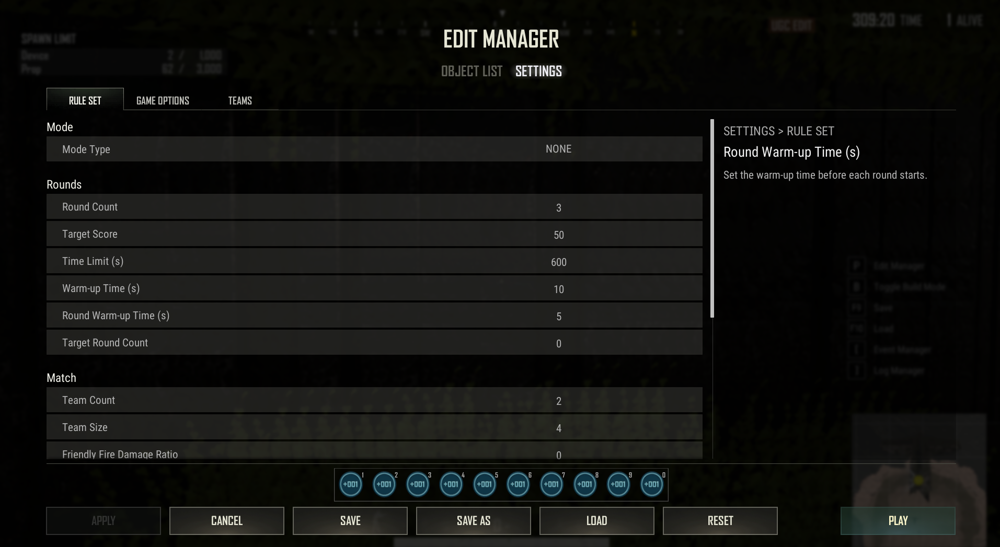

# Settings

## Description

Rulesets define the core rules for your game mode, allowing you to create unique gameplay experiences.  
To access the settings list:

- Press `P` to open the edit manager.
- Navigate to the **Settings** tab.
  

Below you will find a list of all available settings.

## Rule Set

| Category | Rule | Description | Default Value | Range |
|----------|------|-------------|---------------|---------|
| Mode     | Mode Type | Determine the type of mode. | NONE | NONE, SHOOTING: BATTLE ROYALE, SHOOTING: DEATHMATCH, SHOOTING: CONQUEST, OTHER SHOOTING, NON-SHOOTING: PARKOUR, NON-SHOOTING: TRAINING, OTHER NON-SHOOTING |
| Rounds   | Round Count | Set the total number of rounds. If a team wins more than half of the total rounds, that team is declared the winner and the match ends. If there are three or more teams and the number of wins is tied, all tied teams are declared winners. | 3 |  |
| Rounds   | Target Score | Set the target score required to win. The round ends when a team or player reaches the target score. If no one reaches the target score, the team or player with the higher score wins. If scores are tied, all tied teams are awarded one win. | 50 |  |
| Rounds   | Time Limit (s) | Set the time limit per round. When the time limit expires, the team with the higher score wins the round. | 600 |  |
| Rounds   | Warm-up Time (s) | Set the warm-up time before the match starts. | 10 |  |
| Rounds   | Round Warm-up Time (s) | Set the warm-up time before each round starts. | 5 |  |
| Rounds   | Target Round Count | Set the number of rounds required to win. If set to 0, the game ends when a team wins more than half of the rounds. If set to 1 or higher, the game ends when a team wins the specified number of rounds. In this case, winning more than half the rounds does not apply. | 0 |  |
| Match    | Team Count | Set the number of teams in the game. | 2 |  |
| Match    | Team Size | Set the number of players per team. | 4 |  |
| Match    | Friendly Fire Damage Ratio | Set the damage modifier for friendly fire. | 0 |  |
| Match    | Use DBNO | Determine whether the Down But Not Out system is enabled. | False |  |
| Match    | Camera View | Set the player's camera view. | FPS and TPS | FPS and TPS, FPS Only, TPS Only |
| Match    | Use Respawn | Determine whether respawn is enabled. | False |  |
| Match    | Respawn Time (s) | Set the time it takes to respawn after death. | 3 |  |
| Match    | Use Respawn Invincibility | Determine whether to apply an invincibility buff on respawn. | False |  |
| Match    | Invincibility Duration (s) | Set the invincibility buff duration after respawn. | 3 |  |
| Match    | Use Deathboxes | Determine whether to spawn a deathbox when a player dies. | False |  |
| Match    | Deathbox Duration (s) | Set the duration for which the deathbox remains. | 90 |  |
| Match    | Show Killfeed Team Numbers | Determine whether to show each team's number in the killfeed. | True |  |

## Game Options

| Option | Description | Default Value | Range |
|--------|-------------|---------------|---------|
| Allow Team Select | Allow the host to manually select teams. | False |  |
| Overflow Assign | Determine how to handle overflow players when teams are full. | Overflow Assign | Overflow Assign, Spectator, Observer |
| Enable Device Edit | Allow the host to edit devices in the game. | False |  |
| Enable Object Placement | Allow the host to place objects freely in the game. | False |  |
| Fill Test Players | Determine how test players fill empty teams or slots. | None | None, Fill One per Team, Fill All Teams |
| Enable Observer Voice Chat | Determine whether observers can use voice chat. | False |  |
| Use Log | Determine whether to enable logs for debugging or records. | True |  |
