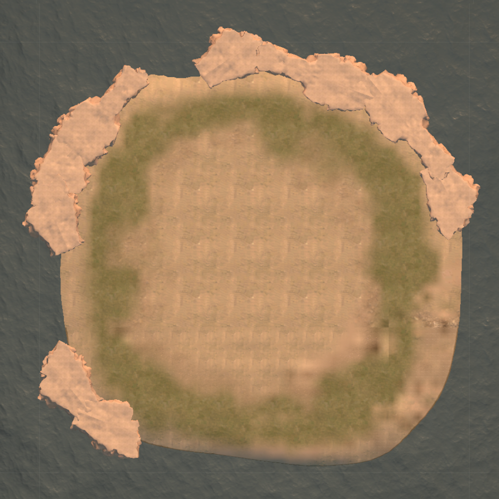
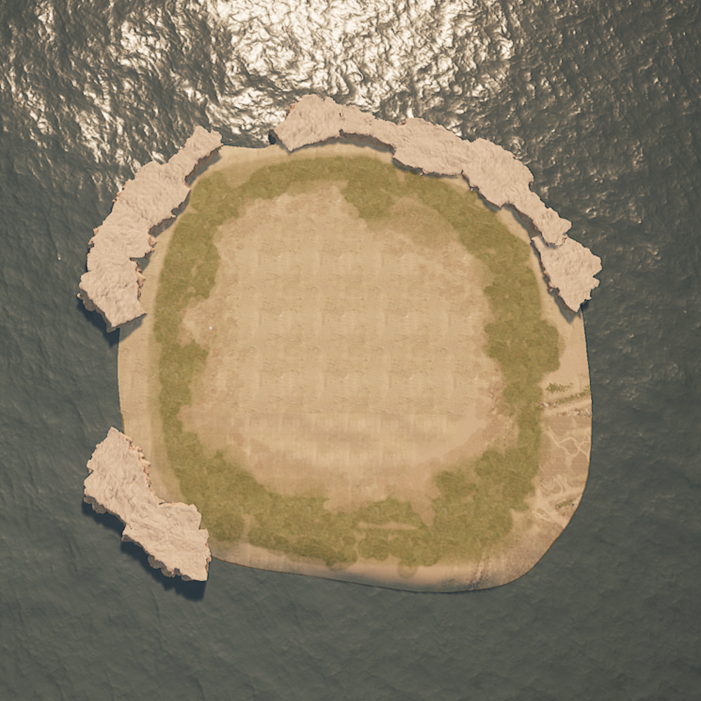

# UGC Map

## Overview

The UGC Map is a dedicated map designed for UGC (User-Generated Content) creation. Currently, it is unclear if additional maps will be introduced in future updates.

## Map Details

### Dimensions
- **Map Code**: *MOD_Main*
- **Size**: 2x2 km
- **Central Island**: 
  - Dimensions: Approximately 400x400 m, elevated around 11 m above sea level
  - Features: Elevated cliffs around the edges.

### Boundaries
- **X and Y Axis**: 
  - Bordered by an invisible wall
  - Players encountering the wall receive a message: "Outside of map"
  - Attempting to bypass the wall (e.g., via building or teleporting) results in instant transportation back to the edge
- **Z Axis (Height)**:
  - Limit: Several kilometers high
  - Building mode: Reaching the height limit may cause player death

### Rendering Behavior
- **Z Render Distance**: Approximately 1 km
- **Dynamic Loading**: 
  - Assets load progressively as players ascend
  - Teleporting into an unloaded chunk may cause character glitches

## Visuals

  
  

## Notes for Creative Builders
- Teleporting into unloaded chunks can result in glitches.
- Consider the Z render distance and dynamic loading when designing teleportation paths.
